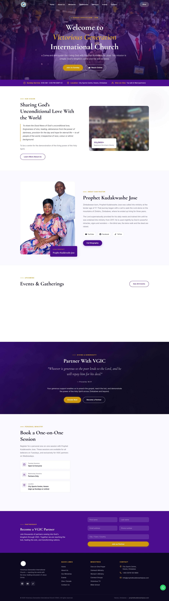
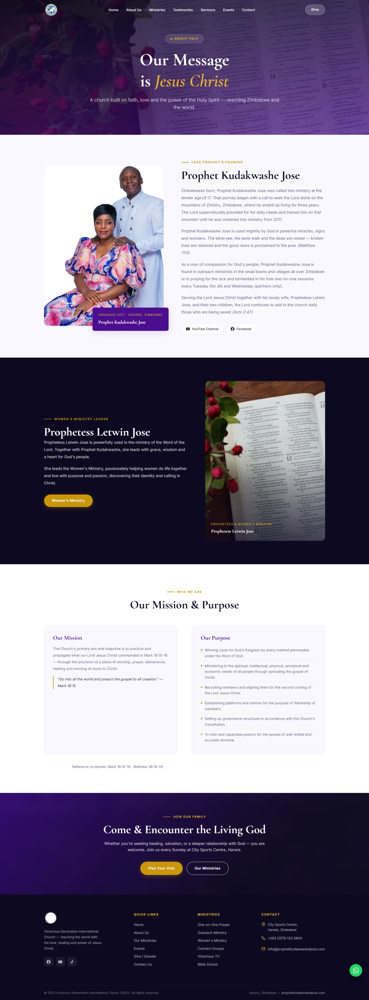
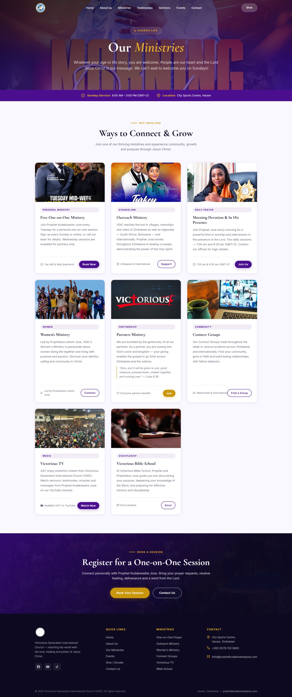
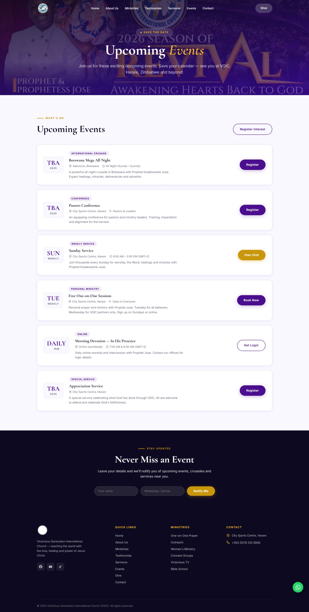
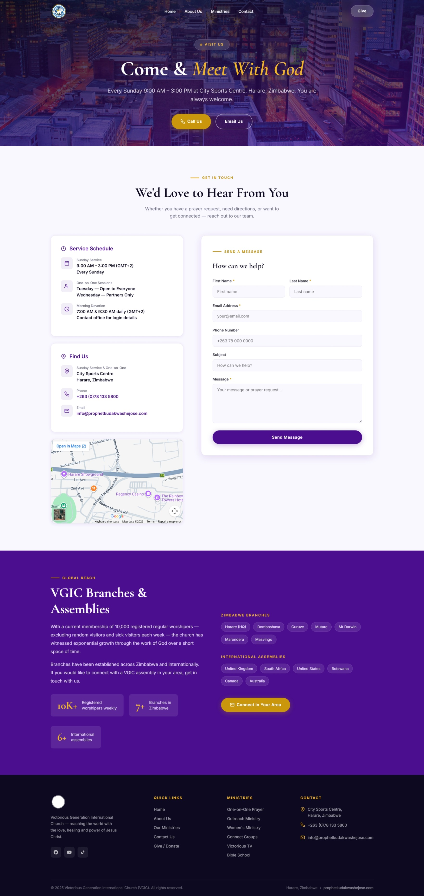

# Victorious Generation International Church (VGIC) — Website Redesign

A modern, responsive website for Victorious Generation International Church, based in Harare, Zimbabwe. Built with plain HTML, CSS, and JavaScript.

## Pages

- **Home** (`index.html`) — Hero, vision, pastor intro, events, giving, and partner sections
- **About** (`about.html`) — Message, leadership, mission & purpose
- **Ministries** (`ministries.html`) — All church ministries and how to get involved
- **Events** (`events.html`) — Upcoming events and gatherings
- **Sermons** (`sermons.html`) — Sermon archive
- **Testimonies** (`testimonies.html`) — Member testimonies
- **Gallery** (`gallery.html`) — Photo gallery
- **Prayer** (`prayer.html`) — Prayer request form
- **Give** (`give.html`) — Giving and partnership
- **Contact** (`contact.html`) — Contact form, service schedule, map, and global branches

## Screenshots

### Home

### About Us

### Ministries

### Events

### Contact

